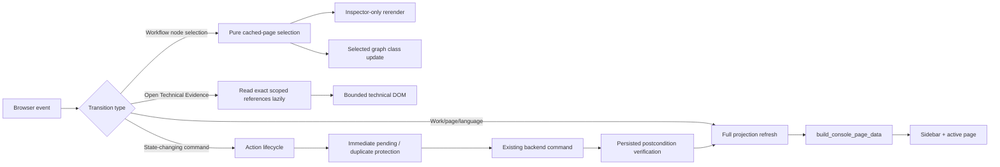

# Workflow-native UI recovery verification

Status date: 2026-08-13

Branch: `codex/v1-workflow-native-ui`

Parent: `origin/codex/v1-canonical-consolidation` at `c0a59c54d6b4cd4153516572166bb4a009c3dc0a`

## Scope and invariants

This pass changes Current Work projection, NiceGUI composition, and transient
browser action feedback only. Work, Run, Part Job, reviewable result, accepted
pointer, lineage, CAD execution, inspection, and publication semantics remain
unchanged. No graph persistence, second workflow engine, Assembly, Deliverable,
provider abstraction, or new CAD capability was added.

The owner scenario is an isolated developer Work under
`workspace/.internal/dev-works`. It uses the real bounded Part Design Episode.
The Camera Cradle Agent response selects `create_contract` but includes an
executable-source field. CadFlow persists the sanitized exchange and typed
`policy_blocked` route, rejects it before execution, and publishes neither
geometry nor a CAD result.

## User-visible recovery

- Overview is state-specific: new Work shows the request and Work Design
  command without empty geometry or Agent panels; reviewable Work puts the
  existing viewer first; blocked Work explains the stop and recovery.
- Workflow is the live Work spine. Completed Work Design remains complete when
  one Part fails. Each Part owns one active attempt node; route/recovery
  evidence no longer creates repeated blocked nodes.
- Selected scope is authoritative. A later Extrusion Adapter provider failure
  remains compact attention and cannot replace Camera Cradle's exact Retry
  command or evidence.
- Agent Design, Activity, and Technical Evidence are separate. Activity
  collapses protocol repetition into product actions. Technical Evidence is
  bounded and absent from the DOM until expanded.
- User request text appears once in its selected inspector. Technical evidence,
  history, and compatibility evidence remain progressively disclosed.

## NiceGUI ownership and refresh boundaries

Focused modules extracted from the composition shell:

| Module | Ownership |
| --- | --- |
| `action_lifecycle.py` | transient command state, duplicate protection, pending/terminal feedback, postcondition checks |
| `workflow_graph_ui.py` | current-attention and dynamic graph rendering |
| `work_outcome.py`, `attempt_ui.py` | typed stopped-attempt outcome and user facts |
| `agent_activity.py`, `agent_activity_ui.py` | meaningful Activity projection and lazy scoped protocol evidence |
| `technical_evidence_ui.py` | generic lazy, bounded evidence disclosure |
| `work_design_ui.py` | complete Work Design owner surface |
| `workbench_styles.py` | canonical workbench styles |

Compatibility fixed-stage and Run Snapshot renderers remain in
`nicegui_app.py` only as compatibility/read-only paths. The canonical Current
Work frontend does not invoke them.

## Code concentration

| Metric | Before | After | Trend |
| --- | ---: | ---: | --- |
| `nicegui_app.py` physical lines | 6,840 | 5,974 | -866 (-12.7%) |
| Workflow-console Python lines | 21,363 | 22,085 | +722 (new focused modules and contracts) |
| All source Python lines | 42,947 | 43,669 | +722 |
| Source Python modules | 82 | 91 | +9 focused modules |

`nicegui_app.py` remains the largest frontend composition file, but it no
longer owns CSS, graph topology rendering, action lifecycle, typed stop copy,
Activity/evidence projection, or the Work Design owner surface. The next two
largest workflow files remain the existing backend (3,135 lines) and product
projection (2,153 lines); no new monolith was introduced.

Classification from the concentration audit:

| Classification | Result |
| --- | --- |
| Canonical Current Work | retained and simplified around Overview/Workflow projections |
| Compatibility-only | fixed-stage and legacy Run Snapshot readers retained behind explicit compatibility paths |
| Redundant UI | removed eager raw Agent Output, duplicate request text, repeated route/recovery graph nodes, and repeated typed-stop headings |
| Dead in-file ownership | deleted old embedded CSS, graph renderer, Agent Output renderer, and lifecycle block after extraction |
| Future/unimplemented | no new future capability implemented |

## Performance measurements

Manual measurements use the same local service, workspace, in-app browser, and
1440px desktop unless noted. They include NiceGUI event/DOM acknowledgement,
not backend mutation timing hidden behind an optimistic UI.

| Interaction | Baseline | Final | Method/result |
| --- | ---: | ---: | --- |
| Home initial render | 1,371 ms | 479 ms | reload to visible Home objective |
| Workflow node selection | 286 ms | 282-295 ms | click acknowledgement / selected inspector content visible |
| Activity disclosure | 756 ms | 300 ms | open to meaningful rows visible |
| Technical Evidence disclosure | 300 ms | 308 ms | lazy artifact reads plus bounded JSON visible |
| State-changing Part command acknowledgement | not recorded | 979 ms | confirmation to visible Running state |
| Real command terminal | not recorded | observed within 8 s | persisted typed provider failure, no result publication |

The largest repeated-read bottleneck was Home building selected-Work detail it
did not consume; Home now avoids that work. Workflow selection no longer
reprojects the Work, rereads the backend, rebuilds the sidebar, or reloads the
viewer: it mutates cached presentation selection and replaces only the
inspector. Technical data is read only when its disclosure opens.

## Browser state matrix

| State | Verified evidence |
| --- | --- |
| Home | product entry, readiness, recent Works, no `Agent Output` normal copy |
| New Work | request + Continue Work Design; no empty geometry or Activity |
| Work Design | complete owner view: generated Parts, reference components, interfaces, dependencies, assumptions, recommendation |
| Multi-Part | independent Camera Cradle and Extrusion Adapter branches/current tasks |
| Ready | actionable Part surface |
| Running | immediate pending state after confirmed real command |
| Blocked | exact typed stop, geometry/result/user-input/retry facts |
| Clarification | needs-input surface and persisted clarification evidence |
| Reviewable | stable geometry viewer, validation, Accept and Revise |
| Selected attempt | exact Part/Run scope; sibling failure does not replace command |
| Activity expanded | concise significant actions, not raw protocol payload |
| Technical Evidence expanded | exact sanitized scoped evidence, lazily loaded |
| History | subordinate immutable Run evidence |
| Responsive/language | English desktop; Chinese at 1024 and 414; no page-level horizontal overflow |

The viewer `src` remained identical before/after Advanced disclosure. Desktop,
1024, and 414 checks reported `scrollWidth == clientWidth`. Browser logs had no
console error entries; three NiceGUI handshake reload log messages correspond
to intentional local server restarts during the verification pass.

## Screenshot evidence

All hashes are SHA-256 and all 17 files are distinct.

| Screenshot | SHA-256 |
| --- | --- |
| `01-home.png` | `66bea012d3e11940c1fec581717c7bb71c44a8c6e0b11b35bbf8a8288056ad78` |
| `02-new-work.png` | `7850b856dca71fee6fcdd2f849d93b1fc41e34c1e4a9054d56667cb1328ba3f3` |
| `03-work-design.png` | `60a593bc4350bd35df37f4e48dceef45277bd82e482b73a844234b06b3d37b19` |
| `04-multipart-work.png` | `aae2f9ef573b548ac9e44184932ac42d64ba0151bc2ef70d367821addd1aa3cd` |
| `05-user-goal-selected.png` | `d0cae25b63452c806c5d9486c8d4423ada8054ff9b3d77e8bf708fd95745e33e` |
| `06-work-design-selected.png` | `401ea3ceccb6aa0e445157f1d102a46ac36a7e228fc67b6cec6b8bcbd5e9c3a6` |
| `07-part-ready.png` | `a284c661bff26b0d9f952fb1b39ad5d1861616f97d78080eb9f7e90fe3c1f317` |
| `08-part-running.png` | `47d41e2bb2b7d213055718312ae12abd84c658e92f455c7f6180c5ef11bfc5ab` |
| `09-part-blocked.png` | `8790f1a802f4c1ca8041ff841bf4e386624baf302f495ab078bd49e180267a05` |
| `10-part-clarification.png` | `ea6d07d3bd0ebe5c7ee5b5bedf9b6e60139d4e499258641d1efaf4ad9892012e` |
| `11-part-reviewable.png` | `c3b09f6ce8c5af6c8d135deab6968af42e5ffeb63ae7aad8800b3cc955ce1c39` |
| `12-blocked-attempt-selected.png` | `b6bd3823a71545d728a4e714bd4b73dda519eb0665da1e7e459b41d90356cb8d` |
| `13-agent-activity-expanded.png` | `b836827b19269ee98fdc4dd6bbb4614ccb20db54d28fd5ad7405354f174062de` |
| `14-technical-evidence-expanded.png` | `be79b13c14a065b5e9ee550b333c63d2e9ec1c4bcdf93b93508ee31ad6a671c7` |
| `15-history.png` | `508b1d3689fca6198d88b1f3f07a1901ac6575387643b6a300e76a1ce8610b47` |
| `16-work-1024.png` | `b2d608e79a40eb7412beec8b409030f058fefd92f0303aa40a543f3093f05528` |
| `17-work-mobile.png` | `aae68962ecf7ccad30e2c14f7ffdebdaa9b7fa0a5c53ef6a180b60cad1e1d2a5` |

Baseline captures are retained separately under `baseline/` for the original
repeated blocked nodes, duplicate request, eager protocol output, and dominant
global failure surface: `01-blocked-overview.png` is
`338f6e4f9b3ad1cc42273d50c59bd874d7a9d005e3387022c3a4984dc99dfd3b`;
`02-agent-output-evidence-expanded.png` is
`e64caee224f11969873217d1c131df2ab1222117cd99939dbecc76659acfb1d1`.

## Automated verification

- Focused Workflow-native projection/UI suite: `87 passed`.
- Complete repository suite: `693 passed, 9 skipped` in 404.88 seconds.
