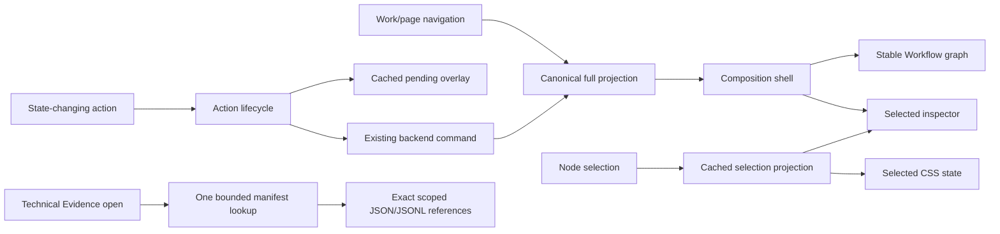
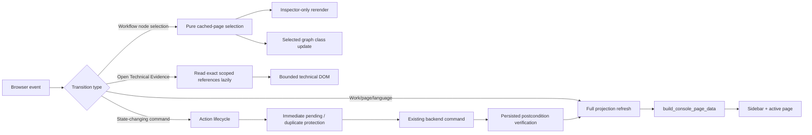

# Workflow-native UI recovery verification

Status date: 2026-08-21

Branch: `codex/v1-nicegui-runtime-cleanup`

Parent: `codex/v1-workflow-native-ui` at
`8e4dd9acc49016e7ab8be233d851c0d2c0dfb146`

## Failure causality and runtime-boundary correction

The 2026-08-16 correction preserves the same Work, Part Job, Run, result, and
lineage authority while making a new rejection record exact at the boundary
where CadFlow rejects an Agent action. A bounded `failure_diagnostic` now
records the rejection stage, rejected action, stable reason code, requested
capability or context, human-safe detail, and whether a side effect started.
The record is carried through the existing Episode outcome and registered
artifact route; provider source, exception prose, credentials, and hidden
reasoning are not copied into it.

The normal blocked-attempt inspector now answers what happened, why it stopped,
who owns recovery, whether CAD code ran, whether geometry or a result exists,
and what can happen next. The modern developer fixture proves the exact
`create_contract` / `python_code` contract rejection before execution. The
older owner fixture remains unchanged and is presented honestly: its evidence
did not preserve the rejected action or more specific local cause, so the UI
does not infer one from the Agent response. A failed attempt remains a blocked
Attempt; its parent Part is incomplete and needs attention rather than being
presented as a failed Part.

### PR #4 Work Design Inspector closure

The selected Work Design node now renders the same persisted stopped-attempt
projection as a blocked Part attempt. The transient Action Lifecycle reports
only that Work Design stopped; the selected Inspector owns the durable what,
why, owner, impact, retryability, and recovery explanation. No new durable
state or workflow projection was introduced.

Recovery semantics remain aligned with the existing domain model. Work Design
retry appends a new bounded Agent Episode to the same Work Design Run, and the
UI says so. A blocked Part recovery creates exactly one child attempt Run with
`parent_run_id` pointing to the stopped attempt, then runs the next Episode on
that child. Accepted pointers and historical Run evidence remain unchanged.

| Acceptance case | Result |
| --- | --- |
| A — local Work Design rejection | exact `create_contract` rejection, Agent owner, no CAD/geometry/result, useful retry |
| B — Agent-reported policy stop | says the Agent reported the stop and CadFlow recorded no local rejected action |
| C — historical unspecified stop | says the rejected action and specific local cause were not saved; no inference |
| D — blocked Part attempt | existing Part-scoped causality retained; recovery creates a child attempt Run |
| E — successful Work Design | Agent Design plus generated Part Jobs remains unchanged |
| F — Workflow selection | cached Inspector-only selection boundary retained; automated no-I/O/no-reprojection checks pass |
| G — fixture classification | verification/regression seeds are developer-only under `.internal/dev-works`; normal catalog hides them |
| H — layouts/language | English 1440; Chinese 1024 and 414; no page-level horizontal overflow or browser errors |

The real browser measured `scrollWidth == clientWidth` at all three widths:
1425/1425, 1009/1009, and 399/399 respectively. Technical Evidence remained
collapsed, the Work retry confirmation used the scoped label, and the dialog
was cancelled without mutating the fixture. Browser error/warning logs were
empty.

### Current rendering and evidence boundaries

`selected_node_inspector_ui.py` now owns the independently replaceable
inspector, while `nicegui_app.py` remains the composition root and supplies
existing preview, action, activity, and evidence renderers. `ui_performance.py`
is opt-in diagnostic timing only. A refresh-local reference map deduplicates
projection reads and is discarded after the refresh; it is not a new cache or
source of product truth. Activity uses browser-native disclosure and incurs no
server callback. Technical Evidence stays collapsed and performs one bounded,
scoped batch read only when opened. Pending action feedback reuses the current
projection; the terminal refresh reprojects canonical durable state.

### Correction measurements

Measurements used the real local NiceGUI service and the same isolated Work.
Browser wall time includes the in-app browser control/event transport. The
native disclosure no-op floor was 264-310 ms, so that wall clock cannot
demonstrate a 150 ms interaction even when the server does no work.

| Interaction | Before | After | Interpretation |
| --- | ---: | ---: | --- |
| Workflow node selection, 10 samples | 298 ms median / 321 ms p95 | 282 ms median / 299 ms p95 | browser-control wall time; below the requested 150/200 target is not measurable through this transport |
| Selection server work | not instrumented | 2.6-5.8 ms total; 1.9-4.9 ms inspector | cached page selection; no backend read, reprojection, sidebar, graph, or viewer rebuild |
| Activity disclosure | about 300 ms wall | no server event; 264-299 ms control floor | native local disclosure |
| First Technical Evidence disclosure | 451-459 ms wall | 288 ms wall / 220.43 ms server | one bounded batch read for three exact references |
| Full Workflow refresh | not phase-timed | 191.84 ms projection / 234.43 ms total | retained for navigation and terminal durable-state refresh |

Exact real-Chrome layout checks produced no console/runtime errors and no
page-level horizontal overflow:

| Viewport | Shell / inspector | Graph overflow | Off-screen controls |
| --- | --- | --- | ---: |
| 1440 x 900 | row / sticky | none | 0 |
| 1024 x 900 | row / static | none | 0 |
| 414 x 896 | column / static | graph-local horizontal scroll only | 0 |

Chinese was the primary verification language for modern exact causality,
historical non-inference, zero-Part, and reviewable Accept/Revise surfaces; the
modern causality surface was also checked in English. Normal inspector content
does not expose raw Run IDs; the exact identifiers remain available in
Advanced/Technical Evidence.

### Correction code concentration

Physical-line counts are repository measurements, not a claim that net line
count alone is a quality metric.

| Metric | Before correction | After correction | Change |
| --- | ---: | ---: | ---: |
| `nicegui_app.py` | 5,974 | 5,829 | -145 |
| Workflow-console Python modules / lines | 29 / 24,090 | 31 / 24,760 | +2 / +670 |
| All source Python modules / lines | 91 / 48,053 | 93 / 49,251 | +2 / +1,198 |

The source increase is primarily the explicit rejection contract and its
product projection, plus the focused inspector and timing boundary. It does not
introduce workflow persistence, another state machine, or a rendering
framework.

The final affected lifecycle subset passed with `88 passed`. The clean complete
repository suite passed with `711 passed, 9 skipped` in 435.85 seconds.

## Scope and invariants

This pass changes Current Work projection, NiceGUI composition, and transient
browser action feedback only. Work, Run, Part Job, reviewable result, accepted
pointer, lineage, CAD execution, inspection, and publication semantics remain
unchanged. No graph persistence, second workflow engine, Assembly, Deliverable,
provider abstraction, or new CAD capability was added.

The owner scenario is an isolated developer Work under
`workspace/.internal/dev-works`. It uses the real bounded Part Design Episode.
The Camera Cradle Agent response selects `create_contract` but includes an
executable-source field. CadFlow persists the sanitized exchange and typed
`policy_blocked` route, rejects it before execution, and publishes neither
geometry nor a CAD result.

## User-visible recovery

- Overview is state-specific: new Work shows the request and Work Design
  command without empty geometry or Agent panels; reviewable Work puts the
  existing viewer first; blocked Work explains the stop and recovery.
- Workflow is the live Work spine. Completed Work Design remains complete when
  one Part fails. Each Part owns one active attempt node; route/recovery
  evidence no longer creates repeated blocked nodes.
- Selected scope is authoritative. A later Extrusion Adapter provider failure
  remains compact attention and cannot replace Camera Cradle's exact Retry
  command or evidence.
- Agent Design, Activity, and Technical Evidence are separate. Activity
  collapses protocol repetition into product actions. Technical Evidence is
  bounded and absent from the DOM until expanded.
- User request text appears once in its selected inspector. Technical evidence,
  history, and compatibility evidence remain progressively disclosed.

## NiceGUI ownership and refresh boundaries

Focused modules extracted from the composition shell:

| Module | Ownership |
| --- | --- |
| `action_lifecycle.py` | transient command state, duplicate protection, pending/terminal feedback, postcondition checks |
| `workflow_graph_ui.py` | current-attention and dynamic graph rendering |
| `work_outcome.py`, `attempt_ui.py` | typed stopped-attempt outcome and user facts |
| `agent_activity.py`, `agent_activity_ui.py` | meaningful Activity projection and lazy scoped protocol evidence |
| `technical_evidence_ui.py` | generic lazy, bounded evidence disclosure |
| `work_design_ui.py` | complete Work Design owner surface |
| `workbench_styles.py` | canonical workbench styles |

Compatibility fixed-stage and Run Snapshot renderers remain in
`nicegui_app.py` only as compatibility/read-only paths. The canonical Current
Work frontend does not invoke them.

## Code concentration

| Metric | Before | After | Trend |
| --- | ---: | ---: | --- |
| `nicegui_app.py` physical lines | 6,840 | 5,974 | -866 (-12.7%) |
| Workflow-console Python lines | 21,363 | 22,085 | +722 (new focused modules and contracts) |
| All source Python lines | 42,947 | 43,669 | +722 |
| Source Python modules | 82 | 91 | +9 focused modules |

`nicegui_app.py` remains the largest frontend composition file, but it no
longer owns CSS, graph topology rendering, action lifecycle, typed stop copy,
Activity/evidence projection, or the Work Design owner surface. The next two
largest workflow files remain the existing backend (3,135 lines) and product
projection (2,153 lines); no new monolith was introduced.

Classification from the concentration audit:

| Classification | Result |
| --- | --- |
| Canonical Current Work | retained and simplified around Overview/Workflow projections |
| Compatibility-only | fixed-stage and legacy Run Snapshot readers retained behind explicit compatibility paths |
| Redundant UI | removed eager raw Agent Output, duplicate request text, repeated route/recovery graph nodes, and repeated typed-stop headings |
| Dead in-file ownership | deleted old embedded CSS, graph renderer, Agent Output renderer, and lifecycle block after extraction |
| Future/unimplemented | no new future capability implemented |

## Performance measurements

Manual measurements use the same local service, workspace, in-app browser, and
1440px desktop unless noted. They include NiceGUI event/DOM acknowledgement,
not backend mutation timing hidden behind an optimistic UI.

| Interaction | Baseline | Final | Method/result |
| --- | ---: | ---: | --- |
| Home initial render | 1,371 ms | 479 ms | reload to visible Home objective |
| Workflow node selection | 286 ms | 282-295 ms | click acknowledgement / selected inspector content visible |
| Activity disclosure | 756 ms | 300 ms | open to meaningful rows visible |
| Technical Evidence disclosure | 300 ms | 308 ms | lazy artifact reads plus bounded JSON visible |
| State-changing Part command acknowledgement | not recorded | 979 ms | confirmation to visible Running state |
| Real command terminal | not recorded | observed within 8 s | persisted typed provider failure, no result publication |

The largest repeated-read bottleneck was Home building selected-Work detail it
did not consume; Home now avoids that work. Workflow selection no longer
reprojects the Work, rereads the backend, rebuilds the sidebar, or reloads the
viewer: it mutates cached presentation selection and replaces only the
inspector. Technical data is read only when its disclosure opens.

## Browser state matrix

| State | Verified evidence |
| --- | --- |
| Home | product entry, readiness, recent Works, no `Agent Output` normal copy |
| New Work | request + Continue Work Design; no empty geometry or Activity |
| Work Design | complete owner view: generated Parts, reference components, interfaces, dependencies, assumptions, recommendation |
| Multi-Part | independent Camera Cradle and Extrusion Adapter branches/current tasks |
| Ready | actionable Part surface |
| Running | immediate pending state after confirmed real command |
| Blocked | exact typed stop, geometry/result/user-input/retry facts |
| Clarification | needs-input surface and persisted clarification evidence |
| Reviewable | stable geometry viewer, validation, Accept and Revise |
| Selected attempt | exact Part/Run scope; sibling failure does not replace command |
| Activity expanded | concise significant actions, not raw protocol payload |
| Technical Evidence expanded | exact sanitized scoped evidence, lazily loaded |
| History | subordinate immutable Run evidence |
| Responsive/language | English desktop; Chinese at 1024 and 414; no page-level horizontal overflow |

The viewer `src` remained identical before/after Advanced disclosure. Desktop,
1024, and 414 checks reported `scrollWidth == clientWidth`. Browser logs had no
console error entries; three NiceGUI handshake reload log messages correspond
to intentional local server restarts during the verification pass.

## Screenshot evidence

All hashes are SHA-256 and all 23 files are distinct.

| Screenshot | SHA-256 |
| --- | --- |
| `01-home.png` | `66bea012d3e11940c1fec581717c7bb71c44a8c6e0b11b35bbf8a8288056ad78` |
| `02-new-work.png` | `7850b856dca71fee6fcdd2f849d93b1fc41e34c1e4a9054d56667cb1328ba3f3` |
| `03-work-design.png` | `60a593bc4350bd35df37f4e48dceef45277bd82e482b73a844234b06b3d37b19` |
| `04-multipart-work.png` | `aae2f9ef573b548ac9e44184932ac42d64ba0151bc2ef70d367821addd1aa3cd` |
| `05-user-goal-selected.png` | `d0cae25b63452c806c5d9486c8d4423ada8054ff9b3d77e8bf708fd95745e33e` |
| `06-work-design-selected.png` | `401ea3ceccb6aa0e445157f1d102a46ac36a7e228fc67b6cec6b8bcbd5e9c3a6` |
| `07-part-ready.png` | `a284c661bff26b0d9f952fb1b39ad5d1861616f97d78080eb9f7e90fe3c1f317` |
| `08-part-running.png` | `47d41e2bb2b7d213055718312ae12abd84c658e92f455c7f6180c5ef11bfc5ab` |
| `09-part-blocked.png` | `8790f1a802f4c1ca8041ff841bf4e386624baf302f495ab078bd49e180267a05` |
| `10-part-clarification.png` | `ea6d07d3bd0ebe5c7ee5b5bedf9b6e60139d4e499258641d1efaf4ad9892012e` |
| `11-part-reviewable.png` | `c3b09f6ce8c5af6c8d135deab6968af42e5ffeb63ae7aad8800b3cc955ce1c39` |
| `12-blocked-attempt-selected.png` | `b6bd3823a71545d728a4e714bd4b73dda519eb0665da1e7e459b41d90356cb8d` |
| `13-agent-activity-expanded.png` | `b836827b19269ee98fdc4dd6bbb4614ccb20db54d28fd5ad7405354f174062de` |
| `14-technical-evidence-expanded.png` | `be79b13c14a065b5e9ee550b333c63d2e9ec1c4bcdf93b93508ee31ad6a671c7` |
| `15-history.png` | `508b1d3689fca6198d88b1f3f07a1901ac6575387643b6a300e76a1ce8610b47` |
| `16-work-1024.png` | `b2d608e79a40eb7412beec8b409030f058fefd92f0303aa40a543f3093f05528` |
| `17-work-mobile.png` | `aae68962ecf7ccad30e2c14f7ffdebdaa9b7fa0a5c53ef6a180b60cad1e1d2a5` |
| `18-work-design-local-rejection-selected-en.png` | `5f8ef449028224d370311dec8db3e0adefd5e23534ad60c8da72bbf6e4718145` |
| `19-work-design-agent-reported-stop-en.png` | `e42e94d3ff75c22a27630843b0a488fdd2b031c546f1d76ff9793ebb399c8d76` |
| `20-work-design-historical-unknown-en.png` | `febc94608190bb7cce44fd953de9444a873ec32e0368228b61d1335856cee59f` |
| `21-part-attempt-recovery-unchanged-en.png` | `815206f3229408c5bdd419641d3247558ec3217c4ea2c263191f71bdc0b6cb35` |
| `22-work-design-local-rejection-1024-zh.png` | `e375c2c89948e211c12c8eeb550488481ca6b98d86319bb0ff95b1924c3961e9` |
| `23-work-design-local-rejection-mobile-zh.png` | `6c0a62aff0d835a14b234e3096910b56cef7980e1fe9eb70889ee5071f8097b4` |

Baseline captures are retained separately under `baseline/` for the original
repeated blocked nodes, duplicate request, eager protocol output, and dominant
global failure surface: `01-blocked-overview.png` is
`338f6e4f9b3ad1cc42273d50c59bd874d7a9d005e3387022c3a4984dc99dfd3b`;
`02-agent-output-evidence-expanded.png` is
`e64caee224f11969873217d1c131df2ab1222117cd99939dbecc76659acfb1d1`.

## Automated verification

- Broad affected Work Design, lifecycle, fixture, path-privacy, and projection
  suite: `412 passed, 1 skipped`.
- Final lifecycle subset after the real-backend child-attempt test and scoped
  retry-copy correction: `88 passed`.
- Python compilation: passed for `src` and `tests`.
- Complete clean repository suite: `711 passed, 9 skipped` in 435.85 seconds.

## V1 Semantic Workflow Map verification — 2026-08-22

This correction keeps the canonical Current Work projection and the
Inspector-only selection boundary. It changes only the projection vocabulary
used for the map and its NiceGUI/CSS presentation:

- the topological spine is User Goal -> Work Design;
- real Part Jobs fan out directly from Work Design (or User Goal for honest
  compatibility data that has no durable Work Design);
- a Part is a compact branch identity, while Attempts, Reviewable Results, and
  Accepted Results remain state markers on that branch;
- result-sourced revisions use a dashed child lane and preserve their source
  result and accepted pointer;
- internal design briefs, candidates, CAD drafts, execution observations, and
  Agent turns remain Inspector Activity/Technical Evidence rather than graph
  nodes. A failed durable execution observation still marks its owning Attempt
  as Failed;
- the former derived `work:decomposition` presentation node was removed because
  it duplicated the real Work Design -> Part Job transition;
- no Assembly node, new domain object, persisted layout, alternate projection,
  graph engine, or dependency was added.

Browser verification covered a zero-Part blocked Work Design, single-Part
reviewable/accepted state, two-Part fan-out with parallel blocked attention,
result-sourced revision, and a read-only historical Run Snapshot. English was
checked at 1440 px; Chinese was checked at 1024 px and 414 px. At 414 px the
page remained `399 == 399` CSS pixels while the graph intentionally scrolled
locally (`341 < 640`, `overflow-x: auto`). Browser warnings/errors were empty.

Ten alternating selections on the two-Part graph measured 268-283 ms through
browser control (273 ms median, 283 ms p95). Server tracing measured 1.43-5.78
ms per selection and emitted only `workflow_inspector_render` and
`workflow_node_selection`; it emitted no artifact read, canonical projection,
sidebar, graph, or viewer refresh. The final multi-Part page render itself was
12.95 ms after projection; the separate cold projection cost was dominated by
existing artifact reads and is not a graph-layout cost.

The eight baseline captures are retained under
`docs/ux/screenshots/semantic-workflow-map/before/`. The verified results are
under `docs/ux/screenshots/semantic-workflow-map/after/`, including zero-Part,
single-Part, multi-Part, blocked, revision, reviewable, accepted, 1024 px,
414 px, and historical Run cases.

Final verification passed: 112 focused Workflow/NiceGUI tests, Python
compilation for `src` and `tests`, and the complete clean repository suite with
`715 passed, 9 skipped` in 435.47 seconds.

## V1 Owner UX & Autonomous Recovery verification — 2026-08-22

The UX audit found that the selected Inspector rendered transient terminal
feedback, a durable status pill, generic readiness copy, the CTA, durable
diagnosis, a Boolean fact matrix, a second state grid, Activity, and Technical
Evidence in that order. Diagnosis therefore arrived after the action, while
`Blocked` and `Ready when you are` appeared together. The corrected normal
order is selected object -> durable diagnosis when present -> ownership/next-
action sentence -> one primary CTA -> relevant design evidence -> collapsed
Activity -> collapsed Technical Evidence. Pending actions instead show only a
compact acknowledgement, Running state, one running sentence, and the disabled
CTA; a terminal command failure remains visible when no durable recovery owns
it.

Action-contract recovery lives in the existing Work Design and Part/Model
Program Episode loops. It adds no Agent, Skill, provider abstraction, Workflow
node, persistence model, or CAD authority. A rejected action counts as an
Episode step. Safe feedback contains only the rejected action, reason code,
allowed/required fields, an optional safe invalid-field identifier, and the
expected Work Design fields. At most two follow-up correction calls are
allowed. The final failure diagnostic records exhaustion/count and is accepted
by the existing strict WorkOrchestrator port as an additive, validated fact.

Repairable reason codes are:

- `action_contract_extra_fields`
- `invalid_action_payload`
- `invalid_work_design_contract`
- `missing_context_key`
- `invalid_question_contract`
- Work Design only: `work_design_proposal_missing`,
  `work_design_questions_unresolved`, and
  `work_design_completion_action_required`

Recursive forbidden-field scanning and cumulative `side_effect_started`
conservatively prevent repair across product identity, Work scope, execution,
tool, policy, credential, filesystem, network, and authority boundaries.
Unknown actions/values, context authorization/availability, provider
transport/JSON failure, user-input stops, environment/runtime failure,
timeouts/resource budgets, Tool Broker/Sandbox rejection, and publication
integrity remain terminal.

Browser acceptance matrix:

| Case | Result |
| --- | --- |
| Work Design Running | final Inspector contained only acknowledgement, Running, running sentence, disabled CTA, Activity/Evidence |
| Work Design successful | scripted real Work reached completed Work Design and one real Part Job |
| Contract error auto-repaired | two distinct contract mistakes corrected in the same Episode; Activity collapsed them to one `Corrected the action format` row |
| Contract repair exhausted | one terminal summary showed two correction attempts, final field, no additional design input, no CAD/result, and one Retry |
| User input required | real clarification node exposed the question and one answer action |
| Environment failure | real Settings surface showed Local CAD execution `Unavailable`; attempt-level environment ownership/retry policy is automated-verified |
| Part Attempt blocked | two-Part fixture retained exact Camera Cradle/Extrusion Adapter attempt scope |
| Reviewable / Accepted | stable geometry/validation evidence and the explicit accepted pointer were visible |
| Multi-Part / revision | independent Part branches and a result-sourced revision lane were visible; accepted result remained intact |
| Responsive / language | English and Chinese checked; 1024 was `1009 == 1009`, 414 was `399 == 399` client/scroll width |

Ten alternating browser-control node selections measured 267-303 ms (278.6 ms
average), including tool transport and DOM acknowledgement. The cached
presentation-only selection function and Inspector-only refresh boundary remain
covered by no-I/O tests; no backend read, canonical reprojection, sidebar,
graph, or viewer rebuild was added. Browser warning/error logs were empty.

The real Owner `机械臂` retry appended one Episode to the existing Work Design
Run and preserved prior evidence. The external provider ended with
`invalid_work_design_contract` on the safe diagnostic field `key`; CadFlow
published no CAD, geometry, result, or Part Job. This is a truthful failed real
trial, not proof that arbitrary mechanical-arm design works. The scripted
Developer Works separately prove successful auto-repair and repair exhaustion
through the real WorkOrchestrator/persistence path.

Saved screenshot evidence:

| Screenshot | SHA-256 |
| --- | --- |
| `before/01-mechanical-arm-work-design-blocked-1440-zh.png` | `1ccc58f20ba7cee75a1130981903cf0566e96229a9a2b9be7a3db36c2a6b41f4` |
| `after/01-mechanical-arm-work-design-blocked-1440-en.png` | `076086a90a63c96896d7c8a8c3ed654a8d1ded570f21e8b76e752619379d24c6` |
| `after/02-mechanical-arm-work-design-blocked-1440-zh.png` | `665cc7beeca2fcf61951883624563279150ab87179a171f1a37712641399a25f` |
| `after/03-contract-repair-auto-repaired-1440-en.png` | `54c8ba1ca603afbb17cc5f20646f06d9fa1961cf589e0bd64807458acc3088a9` |
| `after/04-contract-repair-exhausted-1440-en.png` | `ecf5fd56070c43ac05fa6656503f2ec67002dbd209b96ac543e3967c1c2d5a82` |
| `after/05-work-design-running-quiet-1440-en.png` | `044cfcea241cee3eb538d097d37c1d0bcd898bc348125317842bdb528c0c0c8e` |
| `after/06-responsive-1024-en.png` | `aeac0f9beff2862cb84058e9a484e7c3c8f85a36d9c6317db228ae157188a7b4` |
| `after/07-responsive-414-en.png` | `6a64cf802fa6fdf4bb5ec9736ce783ff14be288a9ae41dddde01a6f07d2b76e1` |

Final verification passed: `187 passed` in the affected integration set,
Python compilation for `src` and `tests`, `git diff --check`, and the clean
complete repository suite with `752 passed, 9 skipped` in 410.13 seconds.
